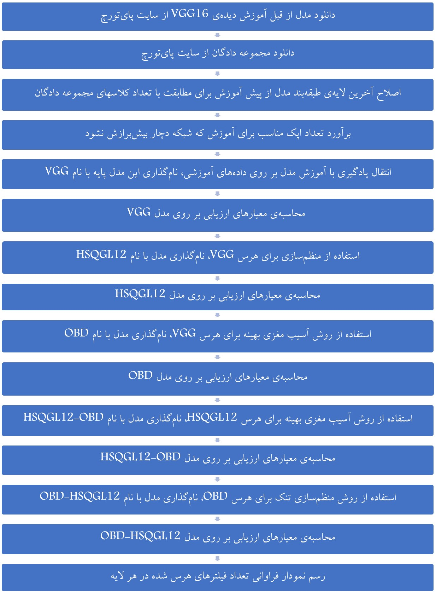
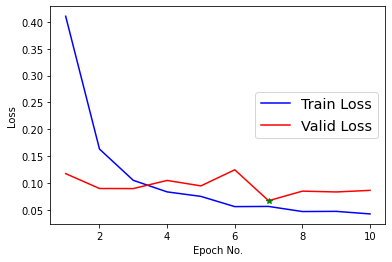
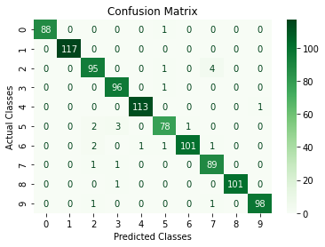
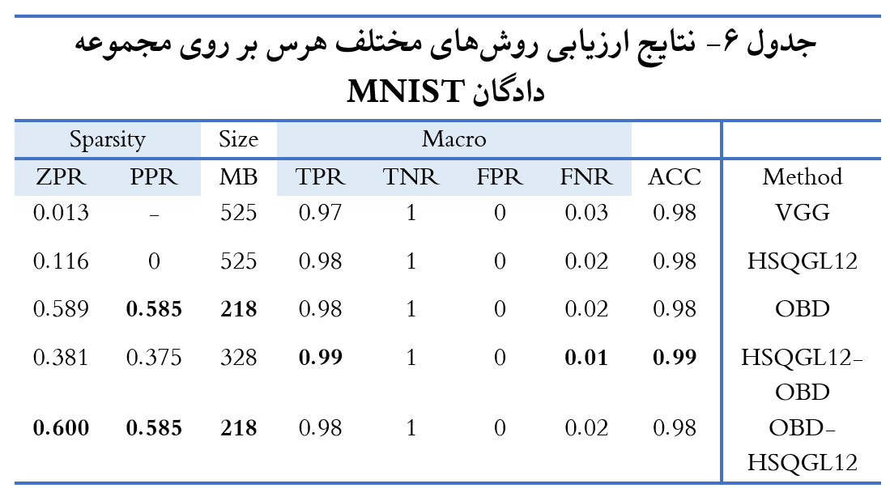
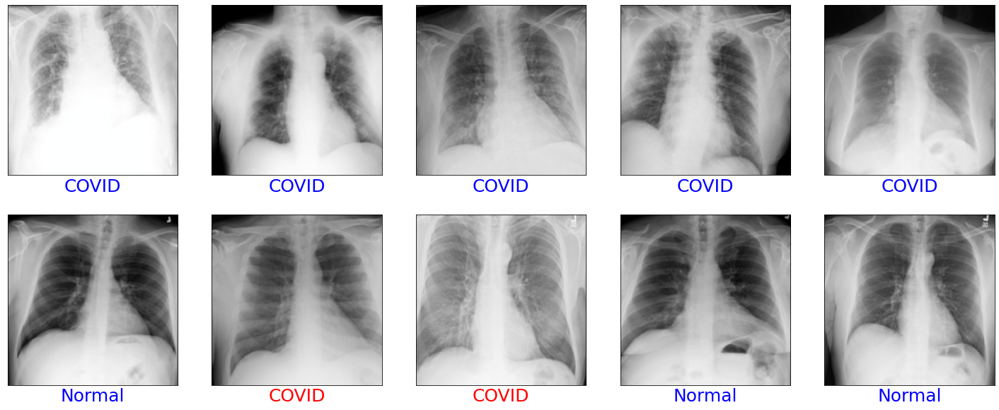

M. Amintoosi, m.amintoosi at gmail.com

کد مربوط به مقاله ارسالی به مجله ماشین بینایی و پردازش تصویر، با عنوان:

## ترکیب روش منظم‌سازی تُنُک و آسیب مغزی بهینه‌ در کوچک‌سازی یک مدل یادگیری عمیق 

### چکیده
یکی از چالش‌های شبکه‌های عصبی پیچشی، به عنوان ابزار اصلی یادگیری عمیق، حجم زیاد برخی از مدل‌های مربوطه است. یک شبکه‌ی عصبی پیچشی به مثابه مدلی از مغز، متشکل از میلیون‌ها اتصال است. کاهش حجم این مدل‌ها از طریق حذف (هرس) اتصالات اضافی مدل انجام می‌شود که همانند یک آسیب مغزی است. دو روش منظم‌سازی تُنُک و آسیب مغزی بهینه از جمله مشهورترین شیوه‌های هرس مدل هستند. در این نوشتار با ترکیب این دو شیوه‌ نتایج بهتری در کاهش حجم مدل حاصل شده است. ابتدا با استفاده از روش انتقال یادگیری، یک مدل بزرگ شبکه‌های عصبی پیچشی برای شناسایی طبقات هدف، آموزش داده شد؛ سپس با روش‌های منظم‌سازی تُنُک و آسیب مغزی بهینه‌، اتصالات اضافی آن هرس شدند. نتایج آزمایشات نشان داده است که در بیشتر مجموعه دادگان مورد بررسی، اعمال شیوه‌ی ترکیبی منظم‌سازی تُنُک و آسیب مغزی بهینه نسبت به اعمال هر یک از آنها به صورت جداگانه کاراتر است. برای یکی از مجموعه دادگان مورد بررسی، با روش ترکیبی پیشنهادی‌  تعداد اتصالات مدل ۷۶ درصد کاهش داده شد، بدون آنکه کارایی آن کاهش یابد. این کاهش حجم مدل، زمان پردازشی را به یک سوم تقلیل داده است. کاهش حجم مدل می‌تواند امکان استفاده از آن در مرورگرها و سخت‌افزارهای ضعیف‌تر و همه‌گیرتر را تسهیل سازد. 

به منظور بررسی روش ترکیبی پیشنهادی، از ۴ مجموعه دادگان استفاده شده است:
MNIST, FashionMNIST, STL10 و COVID19

نحوه‌ی کلی اجرا بر روی مجموعه دادگان مشابه هم است  که در شکل زیر نشان داده شده است:

برای هر یک از مجموعه دادگان فوق یک فایل ژوپیترنوت بوک آماده شده است که قابل اجرا بر روی گوگل کولب است.

یک اجرای کامل هر برنامه حدود ۳ ساعت طول کشیده و نزدیک به ۲ گیگابایت داده و مدل دانلود یا تولید خواهد شد.  همه عملیات روی سرورهای گوگل انجام می‌شود و فقط برخی نتایج بر روی دستگاه شما دانلود می‌شود که می‌توانید صرفنظر کنید.

### مجموعه دادگان MNIST
از لینک زیر می‌توانید برنامه مربوط به این مجموعه دادگان را اجرا کنید

https://colab.research.google.com/github/mamintoosi/Reg-OBD-for-VGG-Pruning/blob/master/main_MNIST.ipynb

برای هر مجموعه داده و برای هر مدل
نمودارهای 
مقدار تابع هزینه برای داده‌های آموزشی و اعتبارسنجی و همچنین ماتریس درهم‌ریختگی حاصل از تست مدل بر روی داده‌های آزمون نمایش داده می‌شود.
<table>
<tr> 
<td> </td>
<td> </td>
</tr>
</table>
در انتهای هر فایل ژوپیترنوت بوک ویژگی‌های مدل‌های مختلف هرس شده نمایش داده شده است که به عنوان نمونه مقایسه‌ی این ویژگی‌ها به صورت زیر در جدول ۶ مندرج در مقاله آمده است:
<table>
<tr> 
<td> </td>
</tr>
</table>

برنامه‌های مرتبط با دو مجموعه داده‌ی FashionMNIST و STL10 از لینک‌های زیر قابل دسترس و اجرا هستند:

https://colab.research.google.com/github/mamintoosi/Reg-OBD-for-VGG-Pruning/blob/master/main_FashionMNIST.ipynb

https://colab.research.google.com/github/mamintoosi/Reg-OBD-for-VGG-Pruning/blob/master/main_STL10.ipynb

### مجموعه دادگان COVID19

#### اجرا در گوگل کولب

برای اجرای برنامه در گوگل کولب از لینک زیر استفاده کنید.
به لحاظ ماهیت تصادفی مقداردهی اولیه‌ی وزنهای شبکه‌های عصبی، روال آموزش شبکه، خصوصیات سرور تخصیص داده شده و ... نتایج در اجراهای مختلف مقداری متفاوت خواهد بود. یک اجرای کامل برنامه حدود ۷۰ دقیقه طول کشیده و نزدیک به ۲ گیگابایت داده و مدل دانلود یا تولید خواهد شد.  همه عملیات روی سرورهای گوگل انجام می‌شود.

https://colab.research.google.com/github/mamintoosi/Reg-OBD-for-VGG-Pruning/blob/master/main_COVID19.ipynb

پس از آموزش یا هرس مدل، نتیجه‌ی اجرای آن روی داده‌های تست و صحت
(Accuracy) 
مدل نمایش داده شده است.
خروجی مدل روی ده تصویر تصادفی آزمون در زیر نشان داده شده است.

 تصاویر سطر اول، همه کووید۱۹ و تصاویر سطر دوم همه نرمال هستند. برچسب زیر هر تصویر، خروجی مدل را مشخص می‌کند. اگر خروجی مدل با مقدار درست مطابقت داشته باشد، برچسب با رنگ آبی و درغیر اینصورت با رنگ قرمز نمایش داده شده است. با توجه به اینکه ده تصویر از ۲۰۰ تصویر به صورت تصادفی انتخاب شده‌اند،‌ ممکن است نتیجه‌ی این ده تصویر با مقدار صحت نمایش داده شده -که بر روی ۲۰۰ تصویر بوده است- یکی نباشد.

در آخرین سلول مشخصات مدل ترکیبی پیشنهادی نمایش داده شده است، با اصلاح مقدار متغیر input_model می‌توان مشخصات سایر مدلها را نیز مشاهده کرد.

